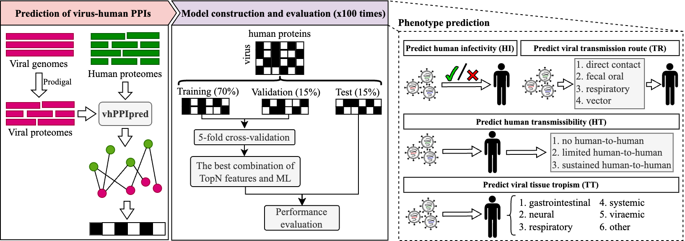

# Virus-human protein-protein interactions predict viral phenotypes

Viral phenotypes such as host and tissue tropism are critical determinants of viral infection and transmission. Inferring viral phenotypes presents unique challenges compared to cellular organisms, as viruses rely entirely on host machinery for replication and survival. Current methods for predicting viral phenotypes mainly rely on viral genomic data, often overlooking host-related information. Here, we evaluated the utility of predicted virus-human protein-protein interactions (PPIs) in inferring diverse viral phenotypes using machine-learning algorithms. For predicting human infectivity, a PPI-based machine learning model outperformed both virus genomic and protein sequence-based models that used large language model embeddings. It also surpassed previous methods that incorporated both viral and host genomic data. The human proteins identified by the model were significantly enriched in functions related to viral infection and immune response. In predicting various phenotypes of human RNA viruses, PPI-based models performed better than virus sequence-based models in forecasting human transmissibility and transmission routes, while showing comparable performance to genomic sequence-based models in predicting tissue tropism. Finally, we demonstrated that a PPI-based model could distinguish high-risk HPV genotypes from low-risk ones. Proteins associated with high-risk HPV were involved in apoptosis and immune regulation, whereas those linked to low-risk HPV were enriched in telomere maintenance and DNA repair. Collectively, this study is the first to demonstrate the value of predicted virus-human PPIs in inferring viral phenotypes, thereby enhancing our understanding of the molecular mechanisms underlying these phenotypes. It also provides effective tools for risk assessment of emerging viruses, contributing to improved pandemic preparedness.

## Workflow for predicting viral phenotypes based on virus-human PPIs


## OS Requirements
All scripts were tested on Ubuntu 24.04.2 LTS operating systems.

## Requirements
```python
Python==3.8.20
pytorch==2.4.0
scikit-learn==1.3.2
xgboost==2.1.1
pandas==2.0.3
numpy==1.24.4
matplotlib==3.7.5
```

## Reproduce figures in paper
The folder (`./scripts/reproduce_figures/`) contains all scripts for reproducing figures shown in paper.


## Prediction of Virus-Human PPIs
> Details are shown in: https://github.com/ZyuanZhang/vhPPIpred.git

## Prediction of virulence
Scripts for virulence prediction are located in `./scripts/predict_virulence_via_vhPPIpredAndGNN/`.


## Prediction of human infectivity
Scripts for human infectiveity prediction are located in `./scripts/predict_human_infectivity/`.

## Prediction of transmissibility
Scripts for transmissibility prediction are located in are in `./scripts/predict_transmissibility/`.

## Prediction of transmission route
Scripts for transmission route prediction are located in `./scripts/predict_transmission_route/`.

## Prediction of tissue tropism
Scripts for tissue tropism prediction are located in `./scripts/predict_tissue_tropism/`.

## High and low risk HPV classification
Scripts for HPV classification are located in `./scripts/predict_HPV_classification/`.


## Citation
```

```
